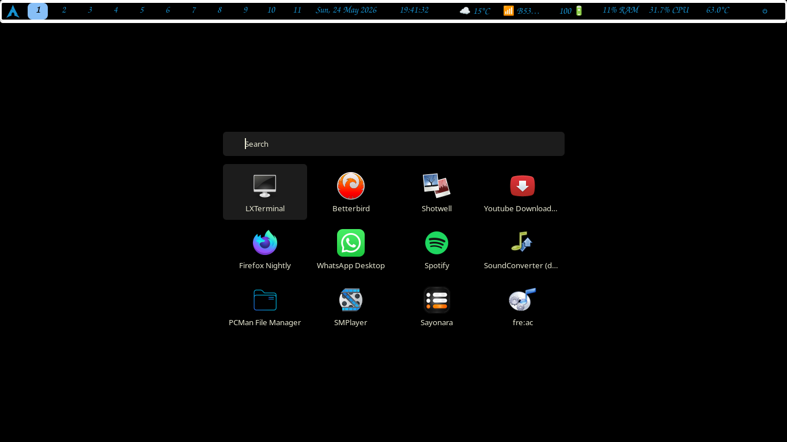
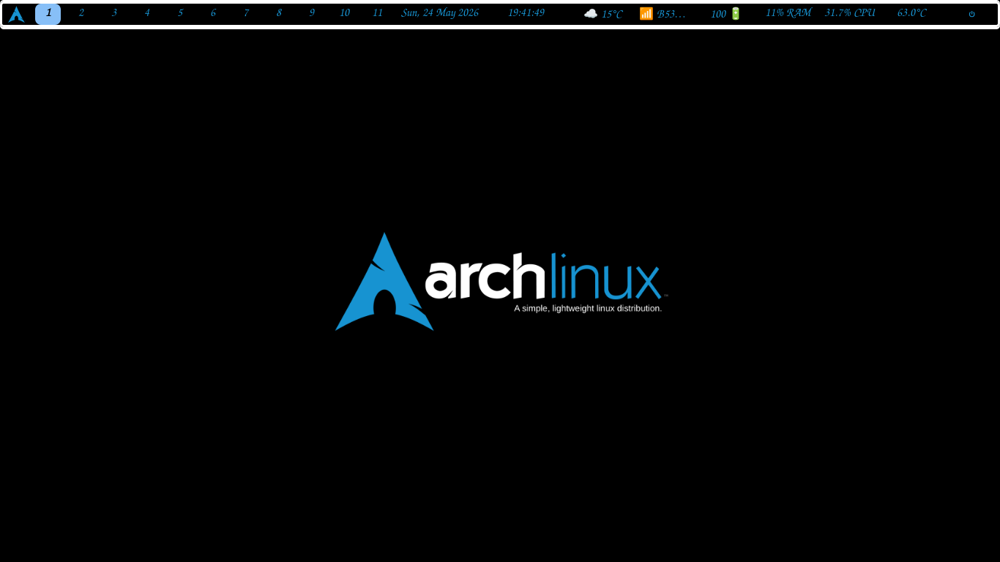
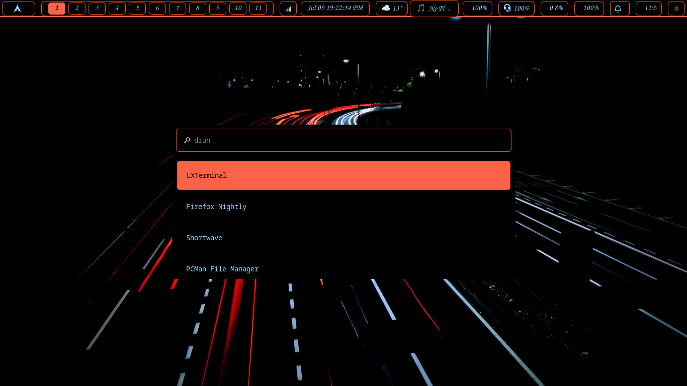
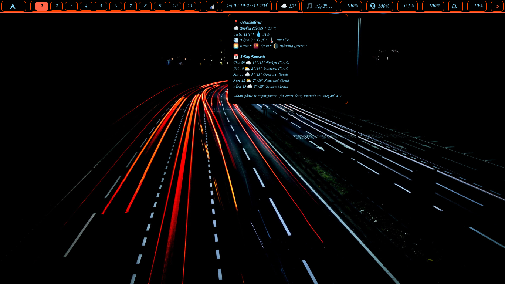
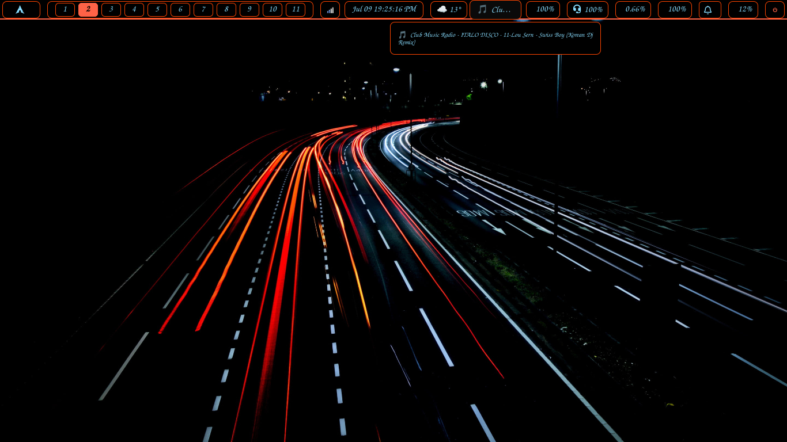

# Sway Dotfiles

  

Tiling Wayland Compositor (i3-compatible) on Arch Linux.

---

## ✨ Features
- **Eww Bar:** Custom `eww` bar with Python workspace integration, bypassing Waybar limitations.
- **Catppuccin Mocha:** Themed with the popular Catppuccin color palette.
- **Window Rules:** Auto-floating, workspace assignment, and 30px rounded corners.
- **Scratchpad:** Binded to Mod+Minus for quick terminal access.

## 📖 Documentation & Installation

For full instructions, Eww bar philosophy, and keybinds, please visit the **[Official Documentation Website](https://wgparch.codeberg.page/sway/)**.

## 📸 Screenshots

